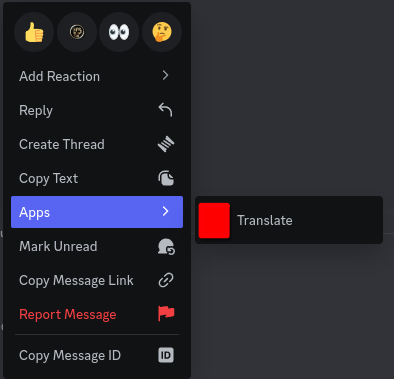
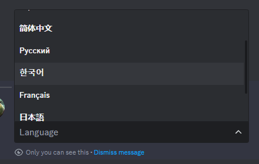

# AA-Translate-Tool

LibreTranslate Helpers for Alliance Auth.

https://github.com/LibreTranslate/LibreTranslate

## Features

- AA-Discordbot Cog for translation of messages on discord.

## Installation

- Install and setup LibreTranslate from its docs, configure as required.

- Install the app with your venv active or add it to your requirements.txt for Docker

```bash
pip install allianceauth-translate-tool
```

or

```
allianceauth-translate-tool==version
```

- Add `'aatranslate',` to your INSTALLED_APPS list in local.py.

- Add or update the following settings in your `local.py` file to configure how translations are performed.

```python
## Settings for AA-Translate-Tool
# Translation provider: "libretranslate" (default) or "openai"
AA_TRANSLATIONS_PROVIDER = "libretranslate"

# Base URL for the translation API endpoint or the openai compatible endpoint
AA_TRANSLATIONS_URL = "http://libretranslate:9095"

# API key for your provider. Required for "openai", optional for self-hosted LibreTranslate.
AA_TRANSLATIONS_API_KEY = None

# Model identifier when using the "openai" provider (e.g. "gpt-4o-mini")
AA_TRANSLATIONS_MODEL = None

# Languages we allow in the tool. list of ("Display Name", "language code https://libretranslate.com/languages") or leave as is for defaults
# If using "openai" the second entry in the tuple is what is passed to the model feel free to use the full language name for less ambiguity.
# AA_TRANSLATIONS_LANGUAGES = [
# ("English", "en"),
# ]
```

- When using `AA_TRANSLATIONS_PROVIDER = "libretranslate"`, the URL should point at your LibreTranslate instance and the API key can be omitted unless the instance enforces it.
- When using `AA_TRANSLATIONS_PROVIDER = "openai"`, set the URL to an OpenAI-compatible base URL, provide a valid API key, and configure `AA_TRANSLATIONS_MODEL` with the target model name.

## Usage






## Libretranslate System Requirements

Seems to be CPU bound using around 2gb of memory. On a 2 core, 4gb instance it takes around a minute to translate 60 words.
