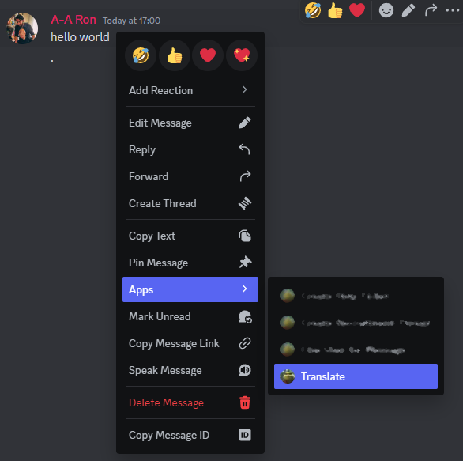

# AA-Translate-Tool

LibreTranslate Helpers for Alliance Auth.

https://github.com/LibreTranslate/LibreTranslate

## Features

- AA-Discordbot Cog for translation of messages on discord.

## Installation

- Install the app with your venv active

```bash
pip install allianceauth-translate-tool
```

- Add `'aatranslate',` to your INSTALLED_APPS list in local.py.

- Add the below lines to your `local.py` settings file, Changing the contexts to yours.

```python
## Settings for AA-Translate-Tool
# URL of the self hosted libretranslate instance
AA_TRANSLATIONS_URL = "http://URL_to_api:5000"
# Optional Api Key
AA_TRANSLATIONS_API_KEY= "i was generated from libretranslate"
# Languages we allow in the tool. list of ("Display Name", "language code https://libretranslate.com/languages")
AA_TRANSLATIONS_LANGUAGES = [] # [("українець", "uk")]
```

## Usage



## Libretranslate System Requirements

Seems to be CPU bound using around 2gb of memory. On a 2 core, 4gb instance it takes around a minute to translate 60 words. 
